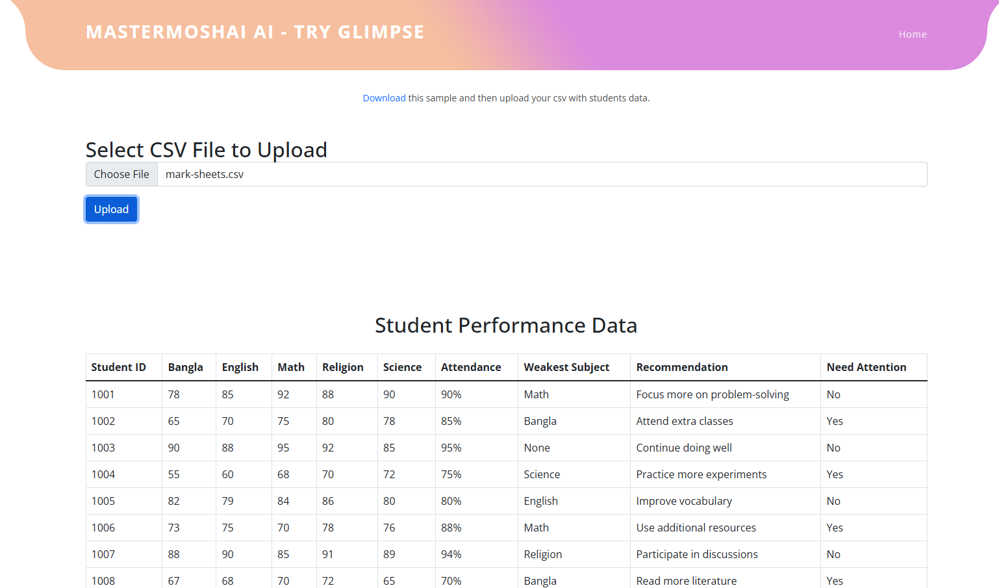

# MasterMoshai Ai



## Project Overview

MasterMoshai Ai is an innovative project designed to assist both teachers and students in the educational process. It leverages AI technologies to enhance learning experiences, streamline teaching methods, and provide personalized educational support.

## Features

- **Teacher Support**: Tools and resources to help teachers manage their classes effectively.
- **Student Assistance**: Features that provide students with tailored learning resources and support.
- **User-Friendly Interface**: Intuitive design for easy navigation and access to resources.

## Project Structure

The project is organized into the following directory structure:

```
├───assets
│   ├───css               # Stylesheets for the project
│   ├───fonts             # Font files used in the project
│   ├───images            # Images used in the project
│   └───js                # JavaScript files for functionality
```

## Installation

To run the project locally, follow these steps:

1. Clone the repository:
   ```bash
   git clone https://github.com/yourusername/MasterMoshaiAi.git
   ```

2. Navigate into the project directory:
   ```bash
   cd MasterMoshaiAi
   ```

3. Open the `index.html` file in your web browser.

## Technologies Used

- HTML
- CSS
- JavaScript

## Contributing

Contributions are welcome! If you would like to contribute, please follow these steps:

1. Fork the repository.
2. Create a new branch (`git checkout -b feature/YourFeature`).
3. Commit your changes (`git commit -m 'Add some feature'`).
4. Push to the branch (`git push origin feature/YourFeature`).
5. Open a pull request.

## License

This project is licensed under the MIT License. See the [LICENSE](LICENSE) file for more details.
